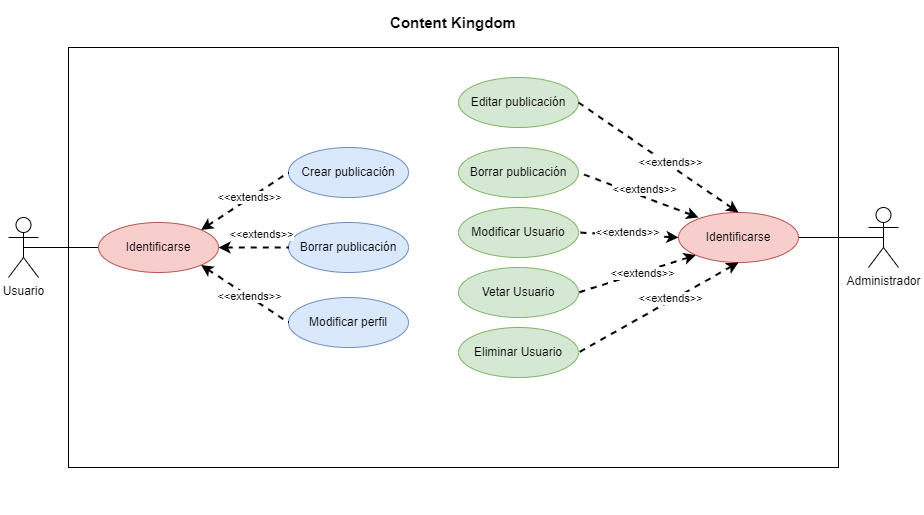

# Casos de uso

## Actores

| Actor | Administrador |
| ------------- | ------------- |
| Descripción | Centraliza toda la aplicación. |
| Características | Administra la aplicación. |
| Relaciones | --- |
| Referencias | Editar Publicación, Borrar Publicación, Modificar Usuario, Vetar Usuario, Eliminar Usuario |
| Notas | --- | 
| Autor  | Víctor Manuel Cabrera Abreu |
| Fecha | 06/05/2023 | 

___

| Actor | Usuario |
| ------------- | ------------- |
| Descripción | Solo utiliza la aplicación |
| Características | --- |
| Relaciones | --- |
| Referencias | Crear Publicación, Borrar Publicación, Modificar Perfil |
| Notas | --- | 
| Autor  | Víctor Manuel Cabrera Abreu  |
| Fecha | 06/05/2023 | 

## Casos de Uso

| Caso de Uso | Modificar usuario |
| ------------- | ------------- |
| Fuentes | --- | 
| Actor | Administrador |
| Descripción | Modifica un usuario |
| Flujo Básico | --- |
| Pre-Condiciones | --- |
| Post-Condiciones | --- |
| Requerimientos | Estar identificado |
| Notas | --- | 
| Autor | Víctor Manuel Cabrera Abreu |
| Fecha | 06/05/2023 |

___

| Caso de Uso | Vetar usuario |
| ------------- | ------------- |
| Fuentes | --- | 
| Actor | Administrador |
| Descripción | Veta a un usuario |
| Flujo Básico | --- |
| Pre-Condiciones | --- |
| Post-Condiciones | --- |
| Requerimientos | Estar identificado |
| Notas | --- | 
| Autor | Víctor Manuel Cabrera Abreu |
| Fecha | 06/05/2023 |

___

| Caso de Uso | Eliminar usuario |
| ------------- | ------------- |
| Fuentes | --- | 
| Actor | Administrador |
| Descripción | Modifica un usuario |
| Flujo Básico | --- |
| Pre-Condiciones | --- |
| Post-Condiciones | --- |
| Requerimientos | Estar identificado |
| Notas | --- | 
| Autor | Víctor Manuel Cabrera Abreu |
| Fecha | 06/05/2023 |

___

| Caso de Uso | Editar publicación |
| ------------- | ------------- |
| Fuentes | --- | 
| Actor | Administrador |
| Descripción | Edita una publicación |
| Flujo Básico | --- |
| Pre-Condiciones | --- |
| Post-Condiciones | --- |
| Requerimientos | Estar identificado |
| Notas | --- | 
| Autor | Víctor Manuel Cabrera Abreu |
| Fecha | 06/05/2023 |

___

| Caso de Uso | Borrar publicación |
| ------------- | ------------- |
| Fuentes | --- | 
| Actor | Administrador, Usuario |
| Descripción | Borra una publicación |
| Flujo Básico | --- |
| Pre-Condiciones | --- |
| Post-Condiciones | --- |
| Requerimientos | Estar identificado |
| Notas | --- | 
| Autor | Víctor Manuel Cabrera Abreu |
| Fecha | 06/05/2023 |

___

| Caso de Uso | Crear publicación |
| ------------- | ------------- |
| Fuentes | --- | 
| Actor | Usuario |
| Descripción | Crea una publicación |
| Flujo Básico | --- |
| Pre-Condiciones | --- |
| Post-Condiciones | --- |
| Requerimientos | Estar identificado |
| Notas | --- | 
| Autor | Víctor Manuel Cabrera Abreu |
| Fecha | 06/05/2023 |

___

| Caso de Uso | Modificar perfil |
| ------------- | ------------- |
| Fuentes | --- | 
| Actor | Usuario |
| Descripción | Modifica el perfil del usuario |
| Flujo Básico | --- |
| Pre-Condiciones | --- |
| Post-Condiciones | --- |
| Requerimientos | Estar identificado |
| Notas | --- | 
| Autor | Víctor Manuel Cabrera Abreu |
| Fecha | 06/05/2023 |

___